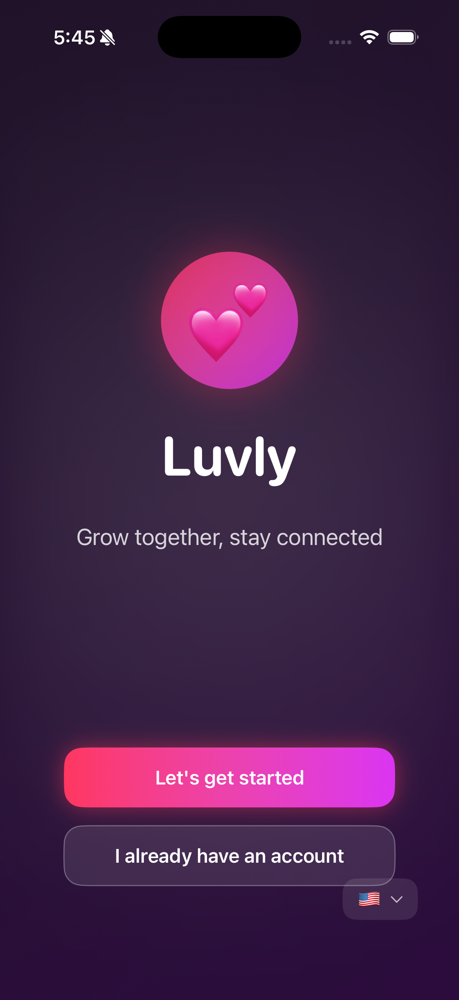
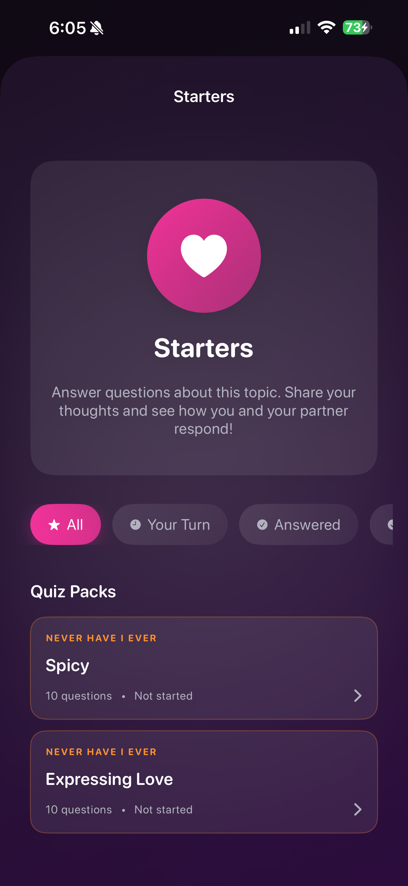
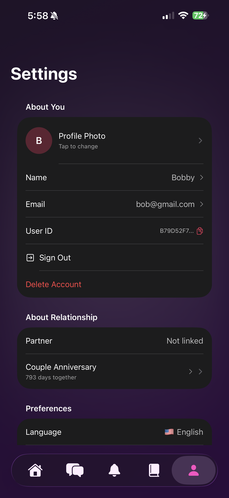

# Luvly - Couple Connection App
## EVERYTHING IS A WORK IN PROGRESS
## Most of the app features right now is mostly UI and still working on backend.

A beautiful iOS app built with SwiftUI that helps couples stay connected through interactive questions, games, and shared experiences.

## 📱 Overview

Luvly is a relationship app designed to help couples deepen their connection through:
- Daily conversation questions
- Interactive quiz games (Never Have I Ever, This or That, Who's More Likely To)
- Shared journal entries
- Real time notifications for partner activities
- Anniversary tracking with live countdown

## ✨ Key Features

### 🔔 Notifications
Real time notifications when your partner:
- Answers quiz questions
- Completes journal entries
- Responds to daily questions

### 🎮 Questions & Games
- **Multiple Game Types**: Never Have I Ever, This or That, Who's More Likely To
- **Topic Based Organization**: Questions organized by themes (Starters, Relationship, Family, etc.)
- **Smart Filtering**: Filter by "Your Turn", "Answered", "Completed", or browse all
- **Progress Tracking**: See completion status for each quiz pack

### 📅 Daily Questions
- New conversation starter every day
- Streak tracking
- Partner response notifications

### ⚙️ Settings & Profile
- Customizable profile with photos
- Anniversary date tracking with live countdown
- Partner connection via secure codes
- Account management

## 🎨 Screenshots

### Onboarding Flow

### Home Screen

### Notifications

### Questions & Games

### Topic Splash

### Settings

### Anniversary Countdown

## 🎬 Demo Videos

### Onboarding Experience

### Quiz Gameplay

### Filtering & Navigation

## 🛠 Tech Stack

- **Language**: Swift 5.0+
- **Framework**: SwiftUI
- **State Management**: Combine, ObservableObject
- **Persistence**: UserDefaults with Codable
- **Architecture**: MVVM pattern
- **Features**: 
  - Local notifications
  - Image picker integration
  - Share sheet integration
  - Timer based live updates

## 📋 Features in work in Detail

### Authentication & Onboarding
- Custom splash screen with language selection
- Multi step onboarding (name, photo, anniversary, email, password)
- Secure partner connection via 6 digit codes 
- Skip option for solo users

### Game System
- Quiz packs organized by topic and game type
- Real time progress tracking
- Filter system for managing answered/unanswered questions
- Partner status indicators

### Data Management
- Local data persistence
- User-specific data isolation
- Account deletion with complete data cleanup

## 🚀 Getting Started

> **Note**: This repository contains demo materials and documentation. The source code is kept private.

If you're interested in learning more about the implementation or would like to see the codebase, please reach out!

## 📸 Portfolio

This project is part of my portfolio. For more projects and contact information, visit ricardobrutus.com

## 📄 License

This project is proprietary and confidential.

---

Built with ❤️ using SwiftUI

